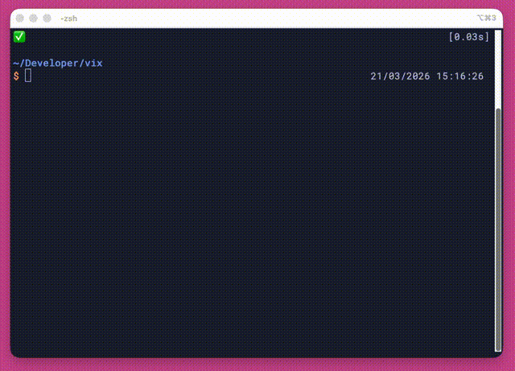

  
   
  
Other coding agents waste tokens. Vix doesn't.

   
  

## Features

### Workflows

Most coding agents have immutable workflows. For example claude code plan mode follow this pattern: exploration, planning, execution, validation.

Vix takes a different approach: it lets you define **workflows**, sequences of discrete steps the agent follows. You control what context is shared between steps and what gets discarded. 

For example `vix` native plan mode enables plan and  . This frees up "mental space" for the LLM to focus on one thing at a time, which has been proven to be significantly more effective. 

**The result is more determinism** in how the agent behaves: instead of a single open-ended prompt doing everything at once, each step does one thing well. You can experiment with different workflows, tweak them, and iterate — your agent, your rules.